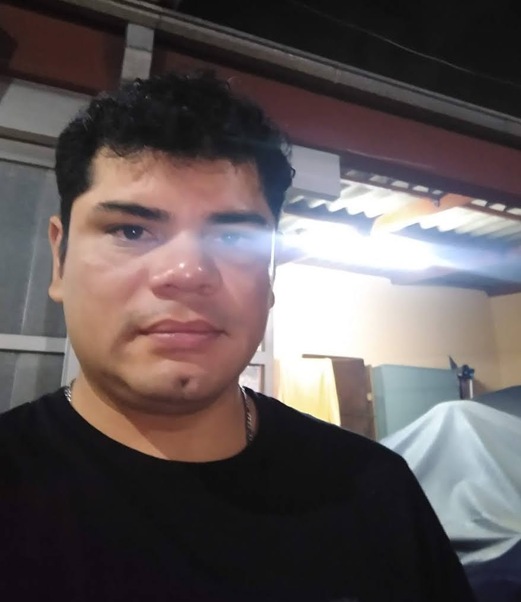

  

  

 <h1>Hola, soy Hernan Viltez 👋</h1>

## Sobre mi: 

Hola, me llamo Hernan tengo 39 años y este es mi tercer cuatrimestre en esta carrera "Tecnicatura en programacion".

Siempre me gusto la tecnologia, trabaje por mi cuenta reparando Pc desde que termine la secundaria(2001). 
Empeze a cursar en UnLAM la ingenieria la cual deje por cuestiones personales y mucho no me gustaba el plan de estudios. 
Trabaje en el rubro ferreteria durante unos años hasta que pude abrir un negocio en el 2009, en Moron "Oeste Informatica" en el cual me fue mal, donde arreglaba pc, instalaba redes, hacia paginas webs y ventas. 
En 2012 retome el estudio haciendo cursos en EducacionIT (programacion, java) que era lo que me gustaba y era un boom en ese momento. 
Hasta que me salio un buen trabajo desde 2013 en la tabacalera (Britsh American tobacco) hasta el 2022 que me echaron. En este momento decidi a retomar el estudio. 

Me puse hacer un curso de Argentina Programa 4.0 Desarrollador FullStack en JAVA (2022-2023), en el cual terminamos una aplicacion de escritorio viendo muchos temas (DB, JAVA 8, Git, JDBC, Swing, MySql).
Actualmente estoy haciendo un curso de Spring Boot en aluraLatam. Me gusta todo de la programacion, pero creo que me gusta mas el backend por tener mayores desafios.

## Mis habilidades tecnicas:

  
 

  

  

## Mis gustos

Desde chico siempre me gustaron los video juegos, Counter Strike desde el 1.5 hasta el actual CS2, DOTA2, Destiny2, son algunos de los que cuando tengo tiempo juego.

Me concidero autodidacta y aprendo muy rapido (el meter mano e investigar), toco la guitarra la cual aprendi solo, bajo y bateria, estuve en algunas bandas de rock hace años. 

Mi clave a tierra es la pesca, soy timonel yate a motor"para salir de pesca cuando se puede o lo necesito.

Mi objetivo ahora es encontrar lo antes posible un trabajo el cual me de experiencia en programacion y poder especializarme profesionalmente en este rubro.

## Contactame:

</a>

## Estadisticas Github

